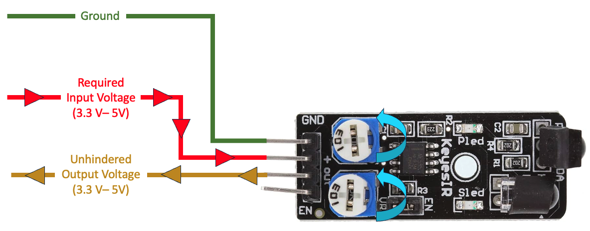

Training Module 01

# Sensor Selection

    

For this training, the first step is to _select a sensor_. While you have the option to pick any of the (37) Arduino sensors provided, it is recommended to use the [KY-032 Infrared Obstacle Avoidance Sensor](https://arduinomodules.info/ky-032-infrared-obstacle-avoidance-sensor-module/) if this is your first time developing a driver for a sensor, as the remaining modules will reference the setup of this specific sensor. Once you understand the basics, setting up other sensors will be much easier.

   
Note:

   

       For your convenience, please reference the 
       [Sensor Guide](https://docs.google.com/spreadsheets/d/1KxU92dxuTOQo6dTAHtTmTw2lgRNJ9GxAE7kaZTy7Gfs/edit?usp=drive_link) 
       for more information when selecting a sensor. This guide was created as a centralized location to provide an 
       overview of each sensor. It is recommended to start with a Digital Sensor instead of an Analog Sensor.
   

## The KY-032 Infrared Obstacle Avoidance Sensor

    
    

Before developing a driver for a sensor, it's always best to obtain as much information as you can about the sensor. Let's start by accessing the [KY-032 Specifications](https://arduinomodules.info/ky-032-infrared-obstacle-avoidance-sensor-module/).

Upon reviewing the specifications, some important takeaways are:

- The KY-032 Sensor has (4) Pins: GND, +, S, and EN.
- The Working Voltage (or _Operating Voltage_) is 3.3V - 5V DC.
- The Output Signal is TTL.
- The module uses (2) knobs to adjust the detection distance (Left Knob) and the frequency of the IR pulse (Right Knob).

### What does this mean?

Let's translate the above specifications into a visual representation (reference the image below). To operate, the sensor needs 3.3V to 5V.

   
Important:

   
If left unhindered, the output voltage of the sensor when operating at normal capacity would also be 3.3V - 5V.

    

## Recap

For this module, you selected a KY-032 Sensor. You learned how to find the specifications for this sensor and the basic anatomy of how the sensor will operate.

