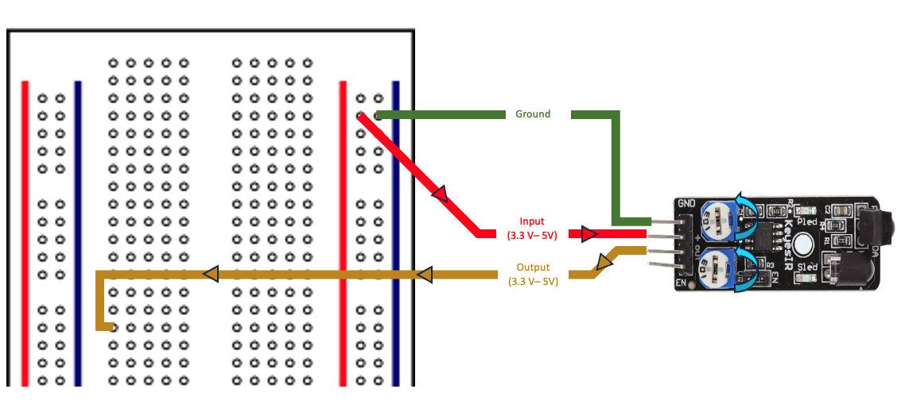
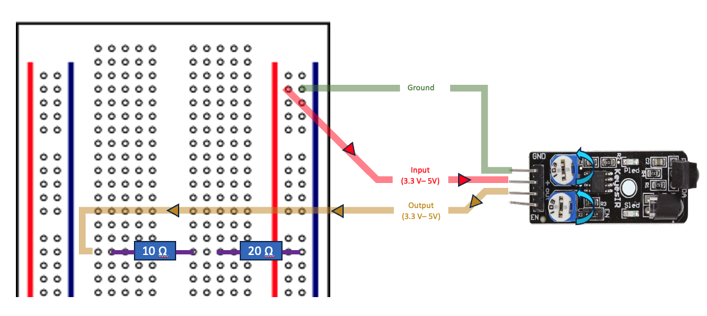
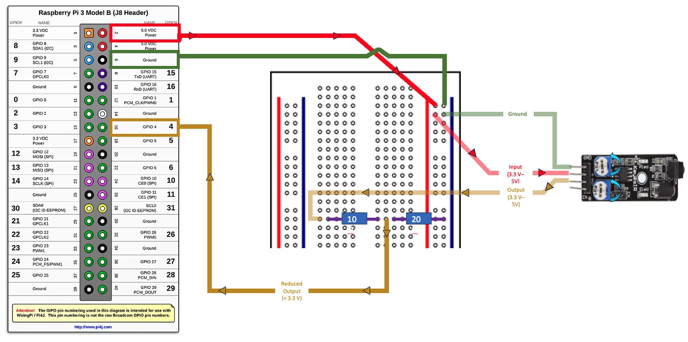

Training Module 02

# Configure Raspberry Pi to your Sensor
## Prerequisites
- Completed <b>Training Module 01: Choosing a Sensor</b>
- KY-032 Sensor
- Raspberry Pi Model 3B
- Raspberry Pi Breadboard
- (6) Female-Male Wire Connectors
- (1) 20Ω Resistor
- (1) 10Ω Resistor

## Introduction
The objective of this module is to familiarize with the basic hardware components of the Raspberry Pi and connect your KY-032 Sensor. At the end of this module, you will have connected your Sensor to the Raspberry Pi. 

### What is a Raspberry Pi
A Raspberry Pi (or <em>R-Pi</em> for short) is a small, affordable computer that can be used for a variety of tasks, from learning programming to building hardware projects and home automation. [The Raspberry Pi Foundation](https://www.raspberrypi.org/about/) created R-Pi's to <em>enable people to realise their full potential through the power of computing and digital technologies</em>. For more information, checkout this [Open Source](https://opensource.com/resources/raspberry-pi) article.

    

R-Pi's provide a set of GPIO (general purpose input/output) pins, allowing you to control electronic components for physical computing and explore the Internet of Things (IoT). During this module, we will utilize these GPIO pins to power our sensor and receive a signal.

### What is an Arduino 
Arduino and Raspberry Pi's are both popular platforms for electronics projects, but they cater to different needs. Arduino is a microcontroller board ideal for simple, real-time control tasks, while Raspberry Pi is a mini-computer that can run a full operating system, making it suitable for more complex projects and applications. For more information about Arudino Boards, [Click Here](https://www.arduino.cc/en/Guide/Introduction/)

## Connecting Arduino Sensor to a Raspberry PI

The [KY-032 Infrared Obstacle Avoidance Sensor](https://arduinomodules.info/ky-032-infrared-obstacle-avoidance-sensor-module/) selected in the previous module is 1 of 37 entry level sensor's designed specifically to function with Aruduino Boards. However, as we will be utilizing a Raspberry Pi, there are some careful consideration's that must be considered. 

- The KY-032 requires an operating voltage of 3.3V - 5V
- A GPIO pin of an R-Pi designated as <em>input</em> have a max allowable voltage of 3.3V (lower than our sensor's current output of 5V).

:::tip
For more information about the GPIO's on a Raspberry Pi, check out [this article](https://www.futurelearn.com/info/courses/robotics-with-raspberry-pi/0/steps/75878).
:::

For this exercise, we will be utilizing the <b>Raspberry Pi 3 Model B</b>. The R-Pi's board contains a single 40-pin expansion header labeled as 'J8' providing access to 28 GPIO pins.

    

        
        
        
Source: <a href="https://www.pi4j.com/1.2/pins/model-3b-rev1.html">pi4j</a>

    

From the previous module, we know that our sensor contains 4 Pins (GND, +, S, and EN). The KY-032 sensor requires an operating Voltage of 5V. If left unhindered, this voltage will carry through the circuit and to our Raspberry Pi's designated GPIO, which has a max allowable voltage of 3.3v. Therefore, we must utilize a Raspberry Breadboard, and a couple resistor's to reduce the Voltage from 5V to 3.3V. By combining this sensor data, with what we now know about the Raspberry Pi, we should be able to get started. 

### Step 1: Connect KY-032 Sensor to Breadboard

### Step 2: Configure Resistor's
In this step, we will configure the resistors to reduce the voltage from 5V to 3V.

### Step 3: Connect Raspberry Pi to Breadboard

## Conclusion
Congratulations! You have successfully wired you're KY-032 Sensor to the Raspberry Pi. In this module, you learned the basics of working with an Arduino Sensor and a Raspberry Pi. 

In the next module, we will focus on the initial setup of a Raspberry Pi and how to connect to it remotely. 

