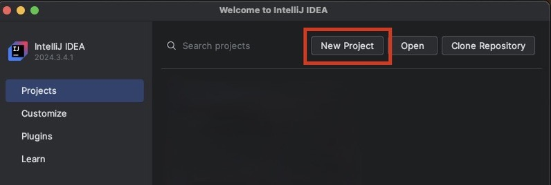
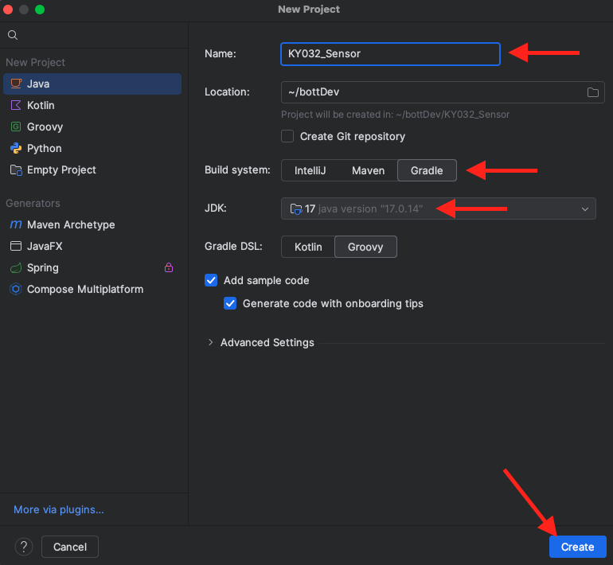
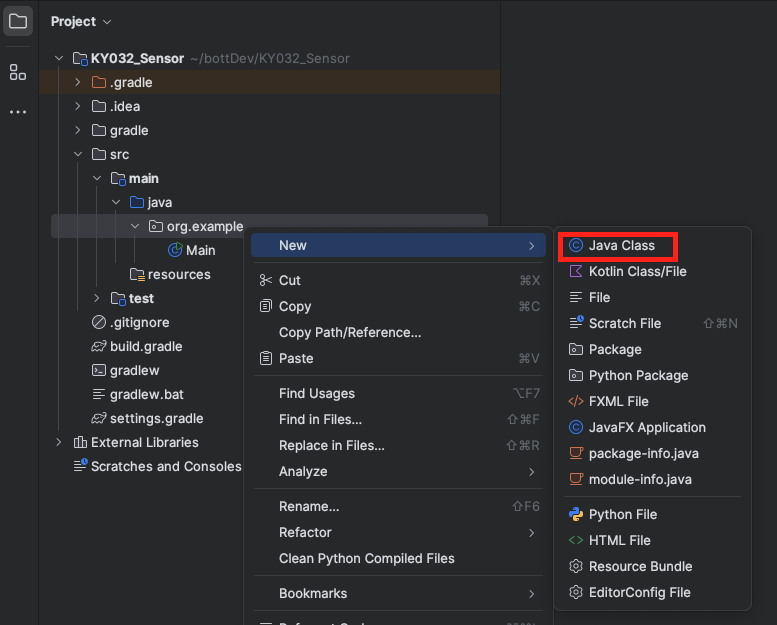

<div style={{ color:"#039dfc", fontWeight:"bold" }} >Training Module 04</div>

# Build an Isolated Driver as a Java Class
### Objective
In this module, we will build an isolated sensor driver in Java utilizing the assistance of the <a href="https://www.pi4j.com/#brief-history">Pi4J</a> Library to communicate with our KY-032 Sensor. 

## Create a Java Project with a Gradle Build System
There are many IDE's, but for this module, we will be using <a href="https://www.jetbrains.com/idea/download/?section=mac#community-edition"> IntelliJ IDEA Community Edition</a>. To follow along, please download using the link provided. 

Once downloaded, open up <b>IntelliJ</b> and select <b>New Project</b>:



Next, configure a new Java Project to use Gradle as the build system and select <b>Create</b>:


Out of the box, IntelliJ sets up a project strucutre with a <b>build.gradle</b> file for build configuration, a <b>src</b> folder for source code (with <b>main</b> and <b>test</b> subfolders), and integrates the Gradle build system for tasks like building, testing, and packaging. 

## Updating build.gradle 
### Adding Library Dependencies
As discussed previously in this module, we will be using the <a href="https://www.pi4j.com/#brief-history">Pi4J</a> Library to communicate with our KY-032 Sensor, which is connected to a Rasbperry Pi. Pi4J was created to provide a friendly object-oriented I/O API and implementation libraries for Java Programmers to access the full I/O capabilities of the Raspberry Pi platform.

Feel free to view more documentation, but for our project, we will require the following (2) packages/plugins:
- <a href="https://www.pi4j.com/1.4/download.html">Pi4J Core</a>
- <a href="https://www.pi4j.com/documentation/providers/gpiod/">GpioD Plugin</a>

Luckily, Pi4J release builds are deployed to <a href="https://mvnrepository.com/">Maven Central</a>, making it simple to add these libraries to our project. When adding dependencies in a Gradle project, you're declaring external libraries or files (like JARs or other projects) that your project needs to function, which Gradle then manages by fetching, compiling, and packaging them into your build output. 

To add a dependency in gradle, the following context can be used:
```gradle
implementation group:<project> name:<artifact> version:<version>
```

Navigate to your <b>build.gradle</b> file in the Java Project you created and add the following under the <em>dependencies object</em>:

```gradle
implementation group: 'com.pi4j', name: 'pi4j-core', version: '2.8.0'
implementation group: 'com.pi4j', name: 'pi4j-plugin-gpiod', version: '2.8.0'
```

### Configure Java-based Application.
As we intend to use this build to create a small, stand-alone application, let's add code to your <b>build.gradle</b> in the appropriate sections:

```gradle
    plugins {
        id 'application'
    }

    application {
        mainClass = 'org.example.Main'
    }

    tasks.<task name> {
        // Configure the run task
    }
```

This plugin simplifies building and running Java applications by handling tasks like packaging, creating executable JARs, and generating distribution archives, making it easier to start and package applications. The ```mainClass``` property within the application object specifies the fully qualified name of the main class that the application will start with. 

The application plugin also adds <em>task</em> such as ```run```, ```startScripts```, and ```installDist``` to your project. Update the ```task``` property with the following code:

```gradle
tasks.withType(Jar).configureEach {
    duplicatesStrategy = DuplicatesStrategy.EXCLUDE
}

```
This code snippet ensures that, when creating JAR files, if there are duplicate files, they will be excluded, and only one copy will be included in the JAR file. It’s useful to prevent errors or bloated JARs caused by duplicated resources.

Finally, we will add the following code to our <b>build.gradle</b> to ensure that Java 17 is used, as this is the most stable version that OSH uses.

```gradle
java {
    toolchain {
        languageVersion = JavaLanguageVersion.of(17) // Change to your desired version
    }
}
```

At this point, the entirety of your gradle file should look like this:
```gradle
plugins {
    id 'java'
    id 'application'
}

group = 'org.example'
version = '1.0-SNAPSHOT'

repositories {
    mavenCentral()
}

dependencies {
    testImplementation platform('org.junit:junit-bom:5.10.0')
    testImplementation 'org.junit.jupiter:junit-jupiter'
    implementation group: 'com.pi4j', name: 'pi4j-core', version: '2.8.0'
    implementation group: 'com.pi4j', name: 'pi4j-plugin-gpiod', version: '2.8.0'
}

test {
    useJUnitPlatform()
}

tasks.withType(Jar).configureEach {
    duplicatesStrategy = DuplicatesStrategy.EXCLUDE
}

java {
    toolchain {
        languageVersion = JavaLanguageVersion.of(17) // Change to your desired version
    }
}
```

<b>!!! MAKE SURE TO SYNC GRADLE CHANGES BY PRESSING  ICON IN THE TOP RIGHT OF YOUR IDE !!!</b>


## Create a KY032 Java Class
Now that we have configured out build settings, let's create a Java Class to represent our KY-032 Sensor. In your project, navigate to the source code and create a <em>New Java Class</em> and name it <b>KY032_Sensor</b>:


In the following code, we will import our Pi4J dependencies and create a constructor (requiring a single argument) for OUR KY032_Sensor Class. When this class is instantiated, a <a href="https://www.pi4j.com/documentation/create-context/">Pi4J Context</a> is created. This context is an immutable runtime object that holds the configured state and manages the lifecycle of a Pi4J instance. We can edit the configuration of this <em>context</em> to create an input configuration that <em>reads</em> the Raspberry Pi's GPIO:

```java
package org.example;

// PI4J DEPENDENCIES
import com.pi4j.Pi4J;
import com.pi4j.context.Context;
import com.pi4j.io.gpio.digital.DigitalInput;
import com.pi4j.io.gpio.digital.DigitalInputConfig;

public class KY032_Sensor {
    // DECLARE CLASS VARIABLES
    private final Context pi4j;
    private final DigitalInput input;
    private final int gpioPin;

    // CONSTRUCTOR
    public KY032_Sensor(int BCMpin) {
        System.out.println("Creating Sensor...");

        // Initialize Pi4J context
        this.pi4j = Pi4J.newAutoContext();
        // Configure GPIO pin (physical pin 16 = BCM pin 23)
        this.gpioPin = BCMpin;

        // DIN = Digital INput
        DigitalInputConfig DINConfig = DigitalInput.newConfigBuilder(pi4j) 
                .id("sensor")
                .name("Obstacle Sensor")
                .address(gpioPin)
                .build();

        this.input = pi4j.create(DINConfig);
    }
}

```

Before we are complete, let's add the following methods to our KY032_Sensor Class. One method will be used to read the sensor when we call it, while the other is a simple clean up method that ends the Pi4J instance.

```java
    // READ SENSOR VALUE
    public int readSensor() {
        return input.isHigh() ? 0 : 1;
    }

    // END pi4j Instance
    public String shutDownSensor() {
        pi4j.shutdown();
        return "pi4j instance has been shutdown";
    }
```

Congratulations! The hard part is over. Now that you have created a KY032 Sensor class, this can be isolated and called upon anywhere. Let's call it in our <b>Main</b> Class for example.

Navigate to your Main Class in the directory and revise your code to read our KY032 sensor:
:::tip
While the sensor is connected to the physical pin #16 of our Raspberry Pi (reference previous module), this is not the number passed as an argument to our method. Pi4J uses <a href="https://www.pi4j.com/documentation/pin-numbering/" >BCM numbering</a>, and not Board numbering.
:::

```java
package org.example;
import java.util.concurrent.TimeUnit;

public class Main {
    public static void main(String[] args) {
        System.out.println("Press Ctrl+C to exit.");

        // CREATE SENSOR
        // Configure GPIO pin (physical pin 16 = BCM pin 23)
        KY032_Sensor sensor = new KY032_Sensor(23);
        try {
            while (true) {
                System.out.println("Sensor Value: " + sensor.readSensor());
                TimeUnit.SECONDS.sleep(1);
            }
        } catch (InterruptedException e) {
            System.out.println("Interrupted!");
        } finally {
            System.out.println("Cleaning up...");
            System.out.println(sensor.shutDownSensor());
        }

    }
}
```
