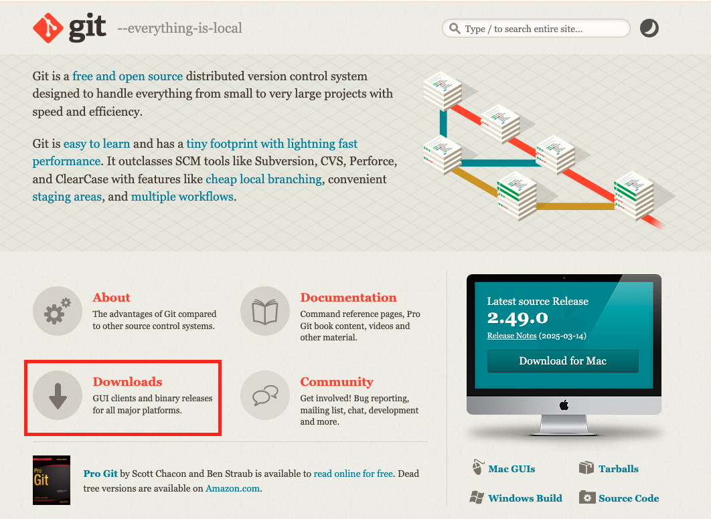
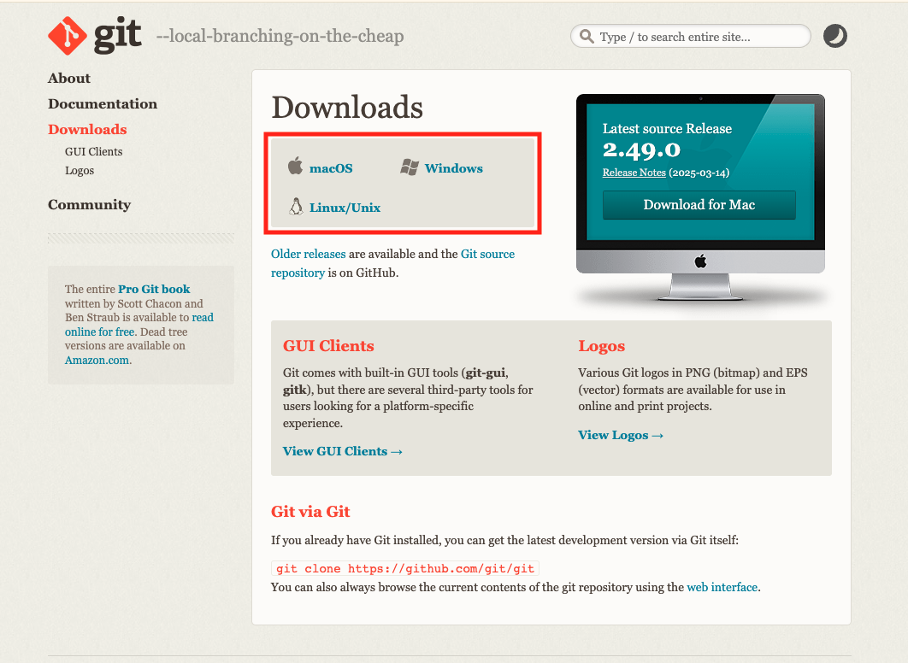
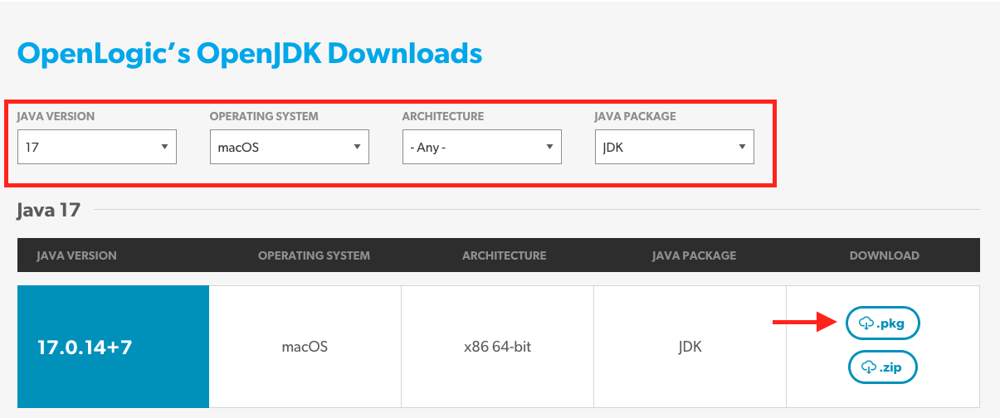
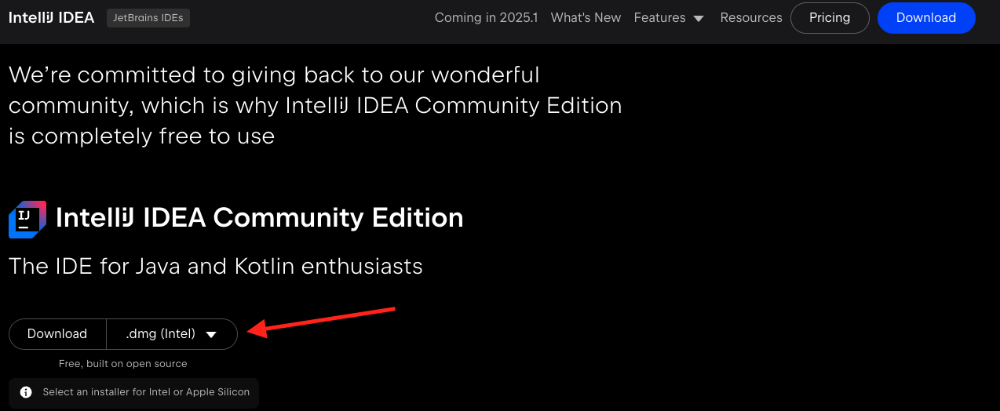

Training Module 04

# Setup Development Environment
### Requirements
- [Git](https://git-scm.com/)
- [Java 17](https://www.openlogic.com/openjdk-downloads?field_java_parent_version_target_id=807&field_operating_system_target_id=431&field_architecture_target_id=All&field_java_package_target_id=396)
- [Gradle](https://gradle.org/install/)
- [IntelliJ IDEA Community Edition](https://www.jetbrains.com/idea/download/?section=mac#community-edition)

### Objective
The previous modules have mainly focused on setting up the hardware components of this training. As we shift our focus to involve more programming, it's important to set up or local development environment. This modules will walk through how to setup your local environment so that following along with the remaining modules will be seamless. 

## Download Git
Git is a distributed version control system that tracks changes in files and allows developers to collaborate on projects efficiently. It's the most widely used version control system in the world, particularly in software development, and is known for its speed, flexibility, and powerful features. 

To get started, visit the [The Git Website](https://git-scm.com/) and follow the instructions to download onto your local computer based on your operating system.

    

    

## Download Java 17 JDK
While there are more current versions of Java, currently, the OpenSenorHub Dev templates only operate on Java 17. Download at [OpenLogic](https://www.openlogic.com/openjdk-downloads?field_java_parent_version_target_id=807&field_operating_system_target_id=431&field_architecture_target_id=All&field_java_package_target_id=396) by select the appropriate fields. Select download and follow the installation instructions:

## Download Gradle
Gradle is a powerful, open-source build automation tool, often used for Java and other JVM-based languages, that automates tasks like compiling, packaging, testing, and deploying software. It's known for its flexibility, scalability, and ability to manage complex projects efficiently. Visit [Gradle.org](https://gradle.org/install/) and follow the instruction to download Gradle onto your local environment.

## Download IntelliJ Community Edition
There are many IDE's, but for this training, we will be using [IntelliJ IDEA Community Edition](https://www.jetbrains.com/idea/download/?section=mac#community-edition). Follow the link provided and follow the steps to download the appropriate version. Make sure to download the correct version for your operating system.

