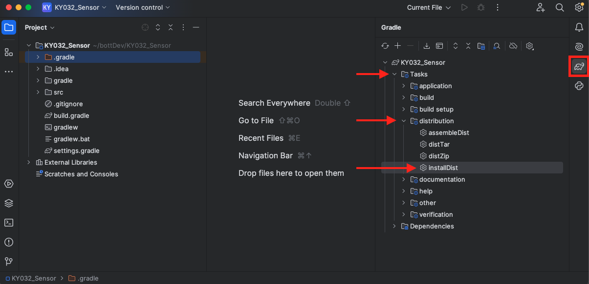

<div style={{ color:"#039dfc", fontWeight:"bold" }} >
    Training Module 05
</div>

# Transfer Files Using SCP
### Requirements
- Completed [Module 03: Configure Raspberry Pi and Remote Connect Using SSH](03_Configure_RPI_and_SSH.md)
- Completed [Module 05: Build Isolated Driver as a Java Class](05_Build_Driver_Class.md)

### Objective
The purpose of this module is to use the Isolated Java Application we created in the [last module](05_Build_Driver_Class.md) to read and display data from the KY-032 Sensor that we previously connected to our Raspberry Pi. To do this, we wll utilize the [Secure Copy Protocol](https://en.wikipedia.org/wiki/Secure_copy_protocol). SCP relies on the SSH protocol that we set up in [Module 03](03_Configure_RPI_and_SSH.md). Let's get started!

## Build Application
In the previous module, we added the <b>appliation</b> pluggin to our ```build.gradle``` file. The pluggin allows you to run gradle ```installDist``` to create an image of the application in build-->install-->projectName. 

Navigate to your project and select ```installDist``` under the gradle menu in IntelliJ:
<div className="imgContainerVert">

</div>

Once the build is complete, you'll notice a new ```build``` directory in your Explorer Tree. The files we need are all contained under the <b>KY032_Sensor</b> Directory:
<div className="imgContainerVert">

</div>

## Create End Point Location on Raspberry Pi
Open your terminal. Make sure that you're Raspberry Pi is connected to the network and use ```ping raspberrypi.local``` like in [Module 03](03_Configure_RPI_and_SSH.md) to get IP Address of the RPi. Use that address to SSH into the Pi:
```bash
ssh pi@<ip address>
password: raspberry
```
Navigate to the RPi's Destop and make a directory called <b>KY032</b> and use the ```pwd``` to display the current directory:
```bash
cd Desktop
mkdir KY032
cd KY032
pwd

>>> /home/pi/Desktop/KY032
```

Therefore, the full address for this destination is:
```
pi@192.168.50.122:/home/pi/Desktop/KY032
```


## Transfer App to Raspberry Pi using SCP
Open a new tab on your terminal and navigate to the build <b>KY032_Sensor</b> Directory of your IntelliJ Project:
<div className="imgContainerVert">

</div>


Next, use the SCP protocol to transfer the <b>KY032_Sensor</b> build to the Raspberry Pi. The general format for SCP is:
```
scp <source> <destination>
```
- <b>source</b> is the file or directory to be copied. 
- <b>destination</b> is the location of where the directory will be copied. The destination requires a username. The default username for a Raspberry Pi is <b>Pi</b> 

In your terminal, write the following:

```
scp -r KY032_Sensor pi@192.168.50.122:/home/pi/Desktop/KY032
```

By using the ```-r``` tag, all files within the directory will be provided. Now, using the previous terminal that is remotely connected to the Raspberry Pi via SSH, you should be able to see your <b>KY032_Sensor</b> application file in the destination diretory. Navigate to this directory and type the following commands:

```bash
ls
>>> bin    lib

java -cp "lib/*" org.example.Main
```

The command ```java -cp "lib/*" org.example.Main``` uses the Java runtime command to include all <em>classpath (-cp)</em> files in the <b>lib</b> directory to run the ```main``` method in the ```org.example.Main.Class```.

In your terminal, you should begin to see a <b>Sensor Boolean Value</b> of either <em>true</em> or <em>false</em> every time the state of sensor's signal changes. If a signal is detected in front of the sensor, the value will be <em>true</em>.


## Conclusion
Congratulations! You officially configured a sensor to a Raspberry Pi, created a driver, and wrote an application to retrieve the sensor results. In the next modules, we will begin to use OpenSensorHub to to look at sensor data. 