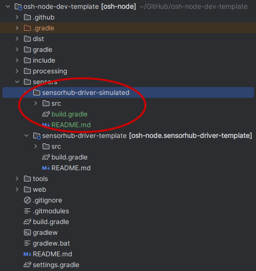
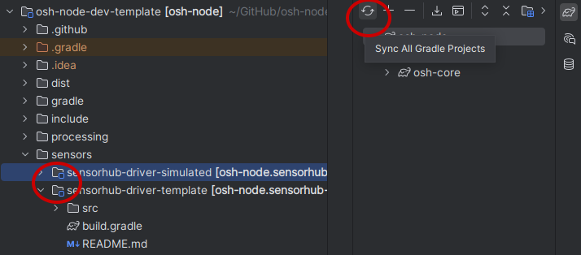
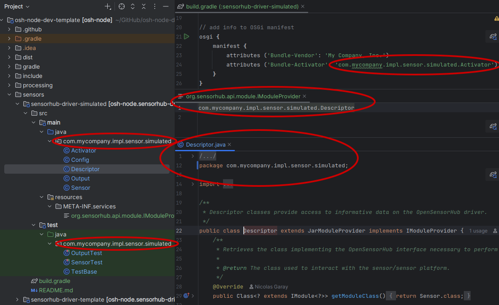
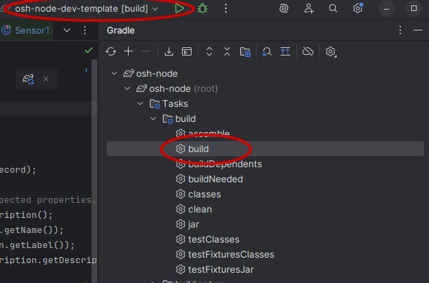
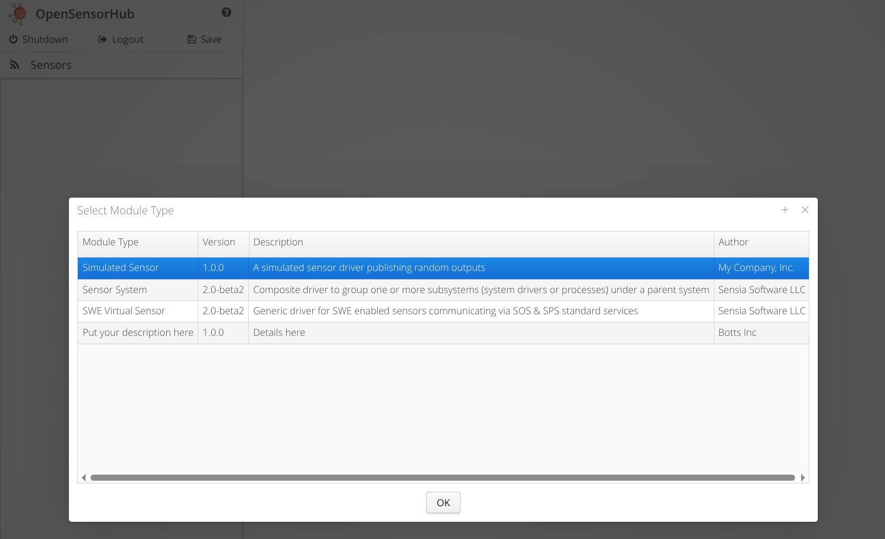
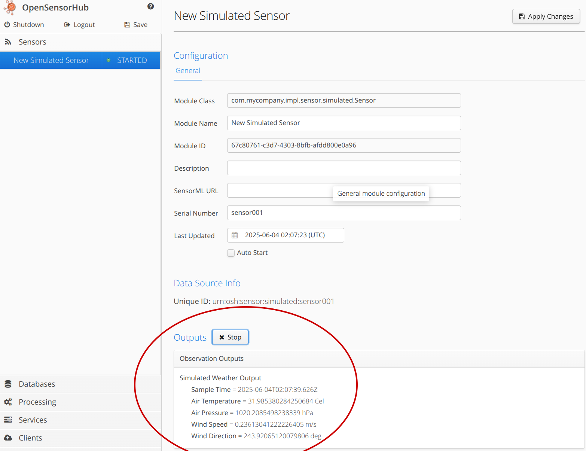

# Creating a Process
In this example, you will use the process template provided to replicate a **Simulated Weather Sensor Process**.

## Prerequisites
It is highly recommended to use an IDE such as IntelliJ IDEA or Eclipse.
IDEs often have great Gradle integration which eases the configuration and build process for your project.

Please make sure you are familiar with OSH through either the [Quickstart Guide](../../quickstart/requirements.md),
or follow the specialized guide to retrieving and learning about the [OSH Node Development Template](../dev-template.md).

It is also highly recommended you check out the dissection of the [Process Template](process-template.md).

## Copy the Template
First, we will make a copy of the process template, and give it a unique name. 
Since our process will be simulated, we can simply name this `sensorhub-process-simulated`.



## Add to Build Configuration
In order to use IDE features such as code completion, syntax highlighting, and debugging capabilities, make sure Gradle recognizes your process module.
### Project Settings
If the process is not already added to the project-level `settings.gradle`, such as through the following code block, then you will need to add it manually.
```gradle title="/osh-node-dev-template/settings.gradle"
FileTree subprojects = fileTree("$rootDir/sensors").include('**/build.gradle')
subprojects.files.each { File f ->
    File projectFolder = f.parentFile
    if (projectFolder != rootDir) {
        String projectName = ':' + projectFolder.name
        include projectName
        project(projectName).projectDir = projectFolder
    }
}
```
Or, if you need to manually add this module to your `settings.gradle` (only if above is not present):
```gradle title="/osh-node-dev-template/settings.gradle
include 'sensorhub-process-simulated'
project(':sensorhub-process-simulated').projectDir = "$rootDir/processing/sensorhub-process-simulated" as File

include 'sensorhub-process-helpers'
project(':sensorhub-process-helpers').projectDir = "$processDir/sensorhub-process-helpers" as File
```
:::tip
Your IDE should hint that the module is a Gradle project.
This means that the module is recognized through the project-level `settings.gradle`.
Below shows the blue icon in IntelliJ IDEA which means the module is recognized.

Please refresh Gradle or "Sync All Gradle Projects" if the module is included but not recognized.


:::

### Project Build Configuration
Once you have verified that your module is included as a Gradle subproject, 
add it to the project-level `build.gradle` as shown by the highlighted line below.

```gradle title="/osh-node-dev-template/build.gradle"
...
dependencies {
  implementation 'org.sensorhub:sensorhub-core:' + oshCoreVersion
  implementation 'org.sensorhub:sensorhub-core-osgi:' + oshCoreVersion
  implementation 'org.sensorhub:sensorhub-datastore-h2:' + oshCoreVersion
  implementation 'org.sensorhub:sensorhub-service-swe:' + oshCoreVersion
  implementation 'org.sensorhub:sensorhub-webui-core:' + oshCoreVersion
  implementation 'org.sensorhub:sensorhub-service-consys:' + oshCoreVersion

  // highlight-next-line
  implementation project(':sensorhub-process-simulated')
   implementation project(':sensorhub-process-helpers')
...
```

## Update Names
Now that the module has been included in our project's build configuration, we can move on to customizing this template.
### Package Names
Please provide a logical package name for your module.
For this example, I will use the package name `com.mycompany.impl.process.simulated`, representing some abstract company.

It is important to update this package name in a few different places.
- In all Java files (including test classes), so their declared package is accurate.
- In the `osgi` task of the module's `build.gradle`, under the `Bundle-Activator` attribute.
- In the META-INF/services file `org.sensorhub.api.module.IModuleProvider`, to reflect the new path of the `Descriptor` class.

Below is an example of some locations for the package name changes.


### Gradle
A few lines must be changed in your module's `build.gradle` to describe the module, and to credit developers and/or organizations for distribution.

The highlighted lines below show some custom information provided for this simulated weather process.

```gradle title="../sensorhub-process-simulated/build.gradle"
// highlight-start
description = 'Simulated Weather Process' // Name of process/module
ext.details = "A simulated process publishing random weather outputs" // Details about the module
// highlight-end
version = '1.0.0' // You may also provide module versioning here

...
...

// add info to OSGi manifest
osgi {
    manifest {
    // highlight-next-line
        attributes ('Bundle-Vendor': 'My Company, Inc.')
        attributes ('Bundle-Activator': 'com.mycompany.impl.process.simulated.Activator')
    }
}

// add info to maven pom
ext.pom >>= {
    developers {
        developer {
    // highlight-start
            id 'johndoe123'
            name 'John Doe'
            organization 'My Company, Inc.'
            organizationUrl 'https://mycompany.com'
        // highlight-end
        }
    }
}

```
### Readme
Be sure to include up-to-date information regarding your process in a README.md file.

Some information includes (but not limited to):
- Supported models compatible with the process
- How to configure the process/module
- Common errors/troubleshooting

## Modify Code
Now, we can modify the template code to create a **Simulated Weather Process** based on this template process.


### Process
A few things need to be specified in our `Process` class.
- **Unique ID, Label, Description**
- **Inputs**
- **Outputs**
- **Parameters**

We'll start with the first updating the `INFO`
```diff
- public static final OSHProcessInfo INFO = new OSHProcessInfo("processname", "Process", "Description of process", Process.class);
+ public static final OSHProcessInfo INFO = new OSHProcessInfo("weather", "Weather Process", "Simple weather process", Process.class);
```

#### Create the Input Data Structure
Define the input to our process, this can be as complex as creating a record or as simple as create data fields. 
```java
 this.inputData.add("weather", input1 = fac.createRecord()
    .name("weather")
    .definition("http://sensorml.com/ont/swe/property/Weather")
    .description("Weather measurements")
    .addField("time", fac.createTime().asSamplingTimeIsoUTC()) // Add time field, this is required for all data structures

    // Add a temperature field
    // highlight-start
    .addField("temperature", fac.createQuantity()
            .definition(SWEHelper.getPropertyUri("AirTemperature"))
            .label("Air Temperature")
            .uom("Cel"))
    // highlight-end
    
    .addField("pressure", fac.createQuantity()
            .definition(SWEHelper.getPropertyUri("AtmosphericPressure"))
            .label("Air Pressure")
            .uom("hPa"))
    .addField("windSpeed", fac.createQuantity()
            .definition(SWEHelper.getPropertyUri("WindSpeed"))
            .label("Wind Speed")
            .uom("m/s"))
    .addField("windDirection", fac.createQuantity()
            .definition(SWEHelper.getPropertyUri("WindDirection"))
            .label("Wind Direction")
            .uom("deg")
            .refFrame("http://sensorml.com/ont/swe/property/NED")
            .axisId("z"))
    .build());
```

#### Create the Output Data Structure
```java
this.outputData.add("weather", output1 = fac.createRecord()
    .name("weather")
    .definition("http://sensorml.com/ont/swe/property/Weather")
    .description("Weather measurements (translated units)")
    .addField("time", fac.createTime().asSamplingTimeIsoUTC())
    .addField("temperature", fac.createQuantity()
            .definition(SWEHelper.getPropertyUri("AirTemperature"))
            .label("Air Temperature")
            .uom("[degF]"))
    .addField("pressure", fac.createQuantity()
            .definition(SWEHelper.getPropertyUri("AtmosphericPressure"))
            .label("Air Pressure")
            .uom("[psi]"))
    .addField("windSpeed", fac.createQuantity()
            .definition(SWEHelper.getPropertyUri("WindSpeed"))
            .label("Wind Speed")
            .uom("[mi_us]/h"))
    .addField("windDirection", fac.createQuantity()
            .definition(SWEHelper.getPropertyUri("WindDirection"))
            .label("Wind Direction")
            .uom("deg")
            .refFrame("http://sensorml.com/ont/swe/property/NED")
            .axisId("z"))
    .build());
```

#### Implement Processing Helper Methods
These are not always necessary and depends on the complexity of the custom process being created. 
```java
private double convertTemperatureToF(double tempC) {
    return (tempC * 9.0/5.0) + 32;
}

private double convertPressureToPSI(double pressHpa) {
    return pressHpa * 0.0145038;
}

private double convertSpeedToMph(double speedMetersPS) {
    return speedMetersPS * 2.23694;
}
```

#### Implement Execute Logic
```java 
@Override
public void execute() {
    DataBlock inputDataBlock = inputData.getComponent("weather").getData(); // retrieve the data from the input data block
    DataBlock outputDataBlock = inputDataBlock.clone(); // clone the datablocks structure to the output datablock
    
    // Perform the processing logic
    // In this case, the input data is being converted from the metric system to the imperial system
    outputDataBlock.setDoubleValue(1, convertTemperatureToF(inputDataBlock.getDoubleValue(1))); 
    outputDataBlock.setDoubleValue(2, convertPressureToPSI(inputDataBlock.getDoubleValue(2)));
    outputDataBlock.setDoubleValue(3, convertSpeedToMph(inputDataBlock.getDoubleValue(3)));


    outputData.getComponent("weather").setData(outputDataBlock); // set the output data with the processed data structure
} 
```


### ProcessDescriptionGenerator
Now modify the `ProcessDescriptorGenerator` to generate the XML description


## Build Project
Now, execute the Gradle `build` task either in your IDE, or through the command line using `./gradlew build`.

:::info
Gradle `build` task in IntelliJ IDEA:


:::

This build process will fail if any of your unit tests fail.
If you choose to build without testing, you may run `./gradlew build -x test`.

:::warning
pay attention to errors, see docs page about common errors and troubleshooting
:::

## Debugging
If you wish to debug your module without having to build a `.zip` distribution every time, 
please see the [Debugging Guide](../debugging.md)

## Test the Process
Time to check out our new process!

I'll quickly run through steps to check that your process is working.
If you get stuck building/launching/configuring, reference the [Quickstart Build Guide](../../quickstart/build.md),
[Quickstart Deployment Guide](../../quickstart/deploying.md),
and [User Documentation](../../user-docs/sensors-and-process-modules.md)

1. Unzip the freshly built OSH node in `/osh-node-dev-template/build/distributions`.
2. Launch the node with the `launch.bat` or `launch.sh` script.
3. Checkout the Admin UI at `http://localhost:8181/sensorhub/admin` (username: `admin`, password: `admin`).
4. Add a new **Sensor** module, ensuring that your new module exists.


5. Configure your sensor and start it.
6. Check that the sensor is publishing outputs.

Below we can see that the process is successfully publishing random weather observations, so the process is working!



7. Add a new "Processing" module
8. Configure the processing module by adding the XML file with the SensorML Process Chain Description that we generated earlier.
9. Start the processing module.
10. Check that the processing module is publishing outputs.