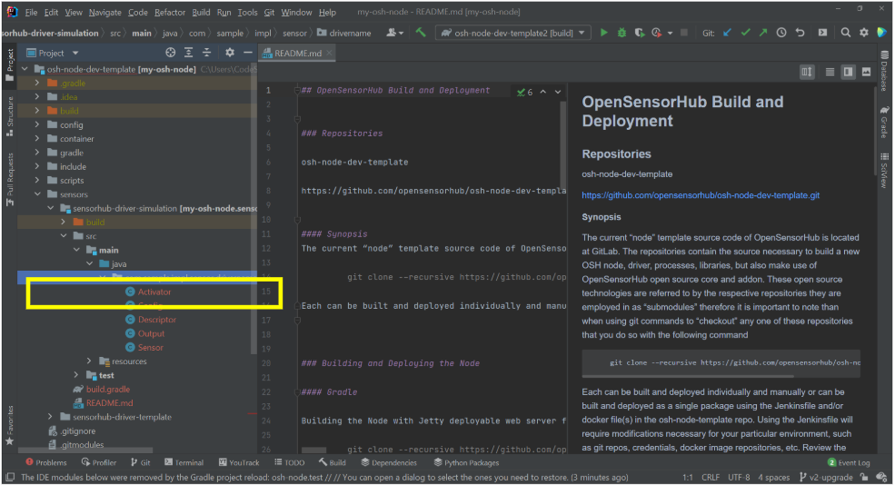
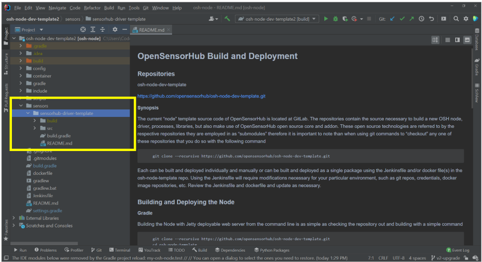
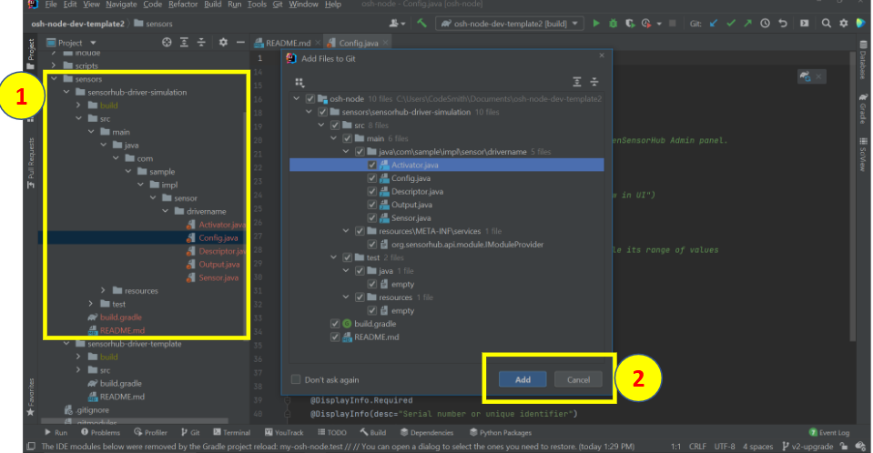
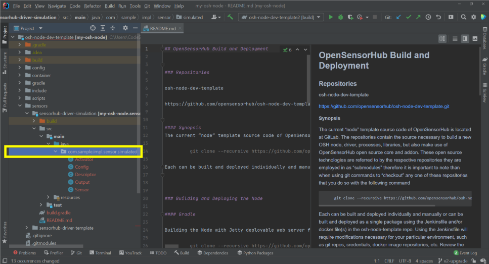
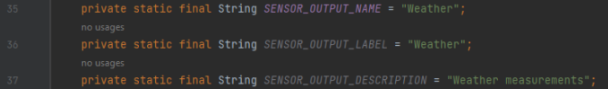

# How to Write an OSH Driver


### Requirements
- Git
- IntelliJ (recommended IDE)
- Java 17 SDK
- Gradle 7.3+
- osh-node-dev-template 
- osh-addons & osh-core submodules


## Getting Started
- After cloning the osh-node-dev-template repository and including the submodules osh-core and osh-addons, open the project in your preferred IDE. We recommend IntelliJ.


<!-- ### Updating the Version Name -->
<!-- 

1. Open project-wide `build.gradle`
2. Change the `version` field
3. Refresh Gradle to apply changes.

### Updating the Distribution Name
<!--  -->

<!-- 1. Open project wide build.gradle
2. Change `distributionBaseName`
3. Refresh Gradle to apply changes
4. Open project wide `settings.gradle`
5. Change `rootProject.name`
6. Refresh Gradle to apply changes

### Testing Version and Distribution Changes -->
<!--  -->

<!-- 1. Execute a `build task`
    - Click the `gradle` on the right side of the screen
    - Under osh-node-dev-template(root), right click the `Tasks> Build> build`
    - Click the 'Edit Run Configuration'
    - in the 'Run' input box, type in 'build -x test -x osgi' and click 'OK'
    - Then Click the Green Run Button on the top toolbar to run the new Build
2. Check the console 
3. Target - if build succeeds, it will create 'build/distributions/ [name]-[version].zip' --> 


## Creating Driver Framework 

### Copying the Driver Template


1. Copy the Driver Template by right clicking the 'sensorhub-driver-template' module and click 'Copy'
2. Paste Template back into the 'Sensors' directory
3. Rename Module by removing 'template' and entering a relevant name
4. Below is a *successfully* created Module,
    - Add files if to be managed by Git, otherwise cancel




### Updating Package Name
1. Navigate to the Driver Package
2. Update the package name by right clicking the package name and update the 
3. Click 'Refactor' button



### Updating Driver Build Scripts
1. Open the 'sensorhub-driver-[name]/build.gradle'
2. Edit the description
    - This field contains the name that will be assigned to your driver and visibile in the OpenSensorHub Admin Panel. 
3. Edit the ext.details
    - This field contains the description assigned to your driver and visible in OpenSensorHub Admin Panel
4. Update the Manifest Details
    - Edit the derails within the 'ext.pom' code block
        - id: nickname , email, etc
        - name
        - organization
        - organizationUrl


### Adding Sensor Driver to Build Target
1. Open the project wide build.gradle
2. Add dependency for the driver

```gradle
    "implementation project(':sensorhub-driver-[name]')"
```

3. Open the settings.gradle
4. Uncomment FileTree Builder
5. Modify FileTree Builder
    - Update the FileTree Builder to ignore project folders that have 'template' in the name
6. Refresh Gradle
7. Your new driver is ready to be built!

### Building Project
1. Execute a 'build task'
        - Click the 'gradle' on the right side of the screen
        - Under osh-node-dev-tempalte(root), right click the `Tasks> Build> build`
        - Click the 'Edit Run Configuration'
        - in the 'Run' input box, type in `build -x test -x osgi` and click 'OK'
        - Then Click the Green Run Button on the top toolbar to run the new Build
2. Check the console 
3. Target - if build succeeds, it will create `build/distributions/ [name]-[version].zip`

### Verifying Build and Deployment
1. Open your file directory
2. Navigate to the location where you created your project, and go to 'osh-node-dev-template/build/distributions'
3. Right click the zipped archive folder, and unzip it
4. Navigate to extracted folder or directory
5. Launch the Server by clicking the 'launch.bat' on Windows and 'launch.sh' for Linux machines.
6. On a successful launch the console.log will display initialization messages and ModuleRegistery started

### Logging into the Admin Console
1. Open supported browser, and navigate to `localhost:8181/sensorhub/admin`
2. Log in with:
    - username: `admin`
    - password: `admin`
3. Right click in the blank area with the "Sensors" drawer and select 'Add New Module'
4. Verify Driver Module appears with a version, description and author
    - If your driver is not listed, refer to debuggin steps
6. Click 'Shutdown' in the Admin Panel to stop the Node

### At this stage you have:
    - Created a skeleton for a driver
    - Configured the build scripts to include the driver in the build target
    - Deployed an OpenSensorHub instance
    - Verified that OpenSensorHub recognizes the driver module.


## Adding SensorML Description Programmatically

### Introduction
This guide explains how to add a SensorML description programmatically using the OpenSensorHub API.

### Using `AbstractSensorModule`
The `AbstractSensorModule` class provides a default implementation of common sensor API methods. It generates default values for:
- A random Unique ID using a UUID.
- A short XML ID.
- A default SensorML description including IDs, temporal validity, I/Os, and position (location + orientation).
- A feature of interest if the sensor configuration provides a static location.

All these defaults can be overridden by derived classes, which also gain access to helper methods for automatic reconnection.

### Extending `AbstractSensorModule`
To implement a sensor, extend the `AbstractSensorModule` class:

```java
package com.sample.impl.sensor.simulated;

import org.sensorhub.api.common.SensorHubException;
import org.sensorhub.impl.sensor.AbstractSensorModule;
import org.slf4j.Logger;
import org.slf4j.LoggerFactory;

/**
 * Sensor driver providing sensor description, output registration,
 * and initialization/shutdown of driver and outputs.
 */
public class Sensor extends AbstractSensorModule<Config> {
    private static final Logger logger = LoggerFactory.getLogger(Sensor.class);
}
```

## Update Sensor Desciprtion
This method should be called whenever the sensor description needs to be regenerated.

Default implementaion reads the base description from the SensorML file if provided and then appends the unique sensor identifier, time validity and the description of all registered outputs and control inputs. 

Override method to provide sensor description programmatically

1. Navigate to 'Sensor.java' and Open the file
2. Override 'updateSensorDescription'

### Updating the Sensor Description
Override updateSensorDescription when updating sensor details:

```java
 synchronized (sensorDescLock) {

         super.updateSensorDescription();

  }
```
Call super to ensure correct execution.


## Building the Sensor Output

### `AbstractSensorOutput`
This class provides default implementations for output API methods, including:
    - Output Description: includes the name, label, description and structure
    - Default Encoding to use when publishing the sensors observations
        - Binary
        - CSV
        - Text Encoding

### Creating the Output Description
When creating the output description you are actually performing two integratl operations at the same time
    1. Building the SensorML description of the output
    2. Defining the data structure that will be instantiated and used to populate the observations for publication

**Note:** The order that you add fields to the output description's DataRecord will be the same order in which you populate the outputs data structure.

1. Navigate and open the Output.java file
2. Update the properties:
    - Three constants are provided to easily modify the descriptive elements of the output
        - SENSOR_OUTPUT_NAME
        - SENSOR_OUTPUT_LABEL
        - SENSOR_OUTPUT_DESCRIPTION



The following properties are provided and will be defined in the **doInit** method of the class.
    - DataRecord: used to describe and define the structure of the output
    - DataEncoding: used to provide the default encoding method for the particular output

Other Properties:
 - allow for multithreaded execution
    - stopProcessing - boolean
    - processingLock – Object for synchronization
    - Worker – Handle to a thread that will run our output loop
- allow timing to be computed for the average sample rate
    - setCount, timingHistogram, histogramLock, and MAX_NUM_
    - TIMING_SAMPLES constant

### Creating the Datastructure
 1. Update the "GeoPosHelper" in the **doInit** method to "SWEHelper"
 2. Create the record by assigning it a name, definition, and description.
 3. Add the Sampling time

 **Note:** All data records must include a sampling time as the first field.

 Adding other fields to the data record:
 Depending on the type of fields being added, there are certain properties that must be specified through the Helper APIs.

 Quantity Fields must include an ontological definition (CF Standard Names), a label, and units of measure.

 For example, if your sensor measured temperature and pressure here is how you would define those fields in your data structure:

 

```java title="Output.java"
public void doInit(){

    datastruct = swefactory.createRecord()
        .name(getName())
        .definition("urn:osh:data:weather")
        .description("Weather Simulator Measurements")

        .addField("time", sweFactory.createTime()
            .asSamplingTimeIsoUTC())
        .addField("temperature", sweFactory.createQuantity()
            .definition(SWEHelper.getCfUri("air_temperature"))
            .label("Air Temperature")
            .uomCode("Cel"))
        .addField("pressure", sweFactory.createQuantity()
            .definition(SWEHelper.getCfUri("air_pressure"))
            .label("Atmospheric Pressure")
            .uomCode("hPa"))
        .build();

}
```

### Controlling Outputs Execution
To control the output execution there are a couple of provided methods in the Output file
    - doStart: called by the parent Sensor to start the output process
    - doStop: called by the parent Sensor to stop the output process
    - isAlive: reports the status of the worked thread is still running in output to the parent Sensor.
    - getRecordDescription: uses the DataRecord dataStruct to provide the description and data structure for the output to OpenSensorHub
    - getRecommendedEncoding: reports the default encoding for the output
    - getAverageSamplingPeriod: computes the average from the historical time between 10 consecutive samples

### Publishing Observations
